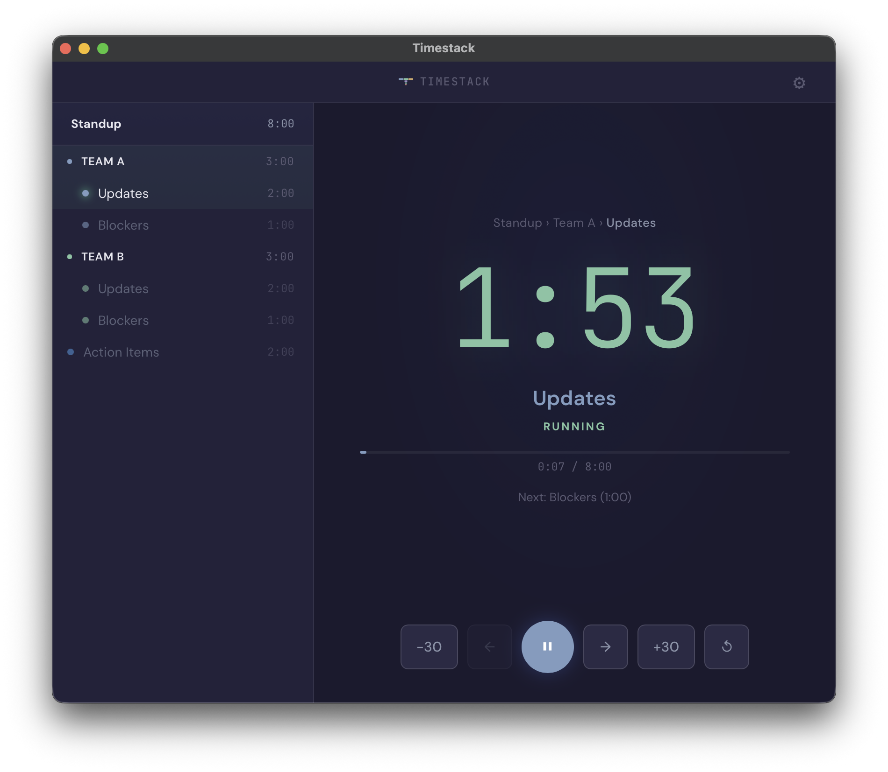
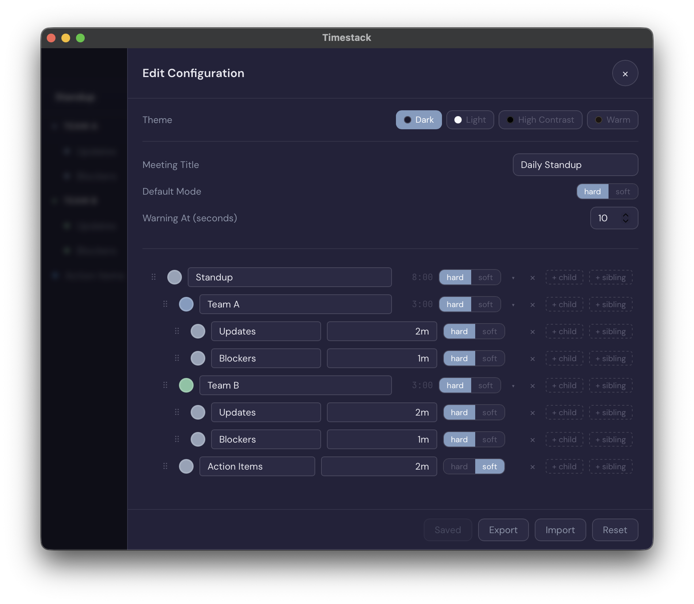

<div align="center">


# Timestack

**Time, in layers.**

[](LICENSE)
[]()
[]()

Timestack is a countdown timer that nests. Define your agenda as a tree of timed segments — meetings, focus sessions, or anything with structure — and Timestack counts down through each layer with visual cues and audio alerts.

No flat list of timers. Just time, structured the way you think.

&nbsp;&nbsp;

</div>

## Table of Contents

- [Download](#download)
- [Features](#features)
- [Config Format](#config-format)
- [Contributing](#contributing)
- [Architecture](#architecture)
- [License](#license)

### Homebrew (macOS)

```bash
brew install --cask jackchuka/tap/timestack
xattr -cr /Applications/timestack.app
```

## Download

| Platform | Download                                                                     |
| -------- | ---------------------------------------------------------------------------- |
| macOS    | [Timestack.dmg](https://github.com/jackchuka/timestack/releases/latest)      |
| Windows  | [Timestack.msi](https://github.com/jackchuka/timestack/releases/latest)      |
| Linux    | [Timestack.AppImage](https://github.com/jackchuka/timestack/releases/latest) |

## Features

- **Tree-based segments** — nest sections arbitrarily (e.g., Team A > Updates, Blockers)
- **Hard / soft modes** — hard stops at zero, soft allows overtime
- **Per-segment colors and warnings** — visual cues when time is running low
- **Audio alerts** — beeps for warnings and transitions
- **Themes** — dark and light
- **JSON config editor** — edit your timer structure directly in the app
- **Persistence** — saves configs locally
- **Desktop app** — native macOS, Windows, and Linux via Tauri

## Config Format

Timers are defined as a tree of segments in JSON:

```json
{
  "version": 1,
  "title": "Daily Standup",
  "config": {
    "defaultMode": "hard",
    "warningAt": 10
  },
  "root": {
    "name": "Standup",
    "children": [
      {
        "name": "Team A",
        "color": "#7c9cbf",
        "children": [
          { "name": "Updates", "duration": "2m" },
          { "name": "Blockers", "duration": "1m" }
        ]
      },
      {
        "name": "Team B",
        "color": "#7bc5a3",
        "children": [
          { "name": "Updates", "duration": "2m" },
          { "name": "Blockers", "duration": "1m" }
        ]
      },
      { "name": "Open Discussion", "duration": "5m", "mode": "soft" },
      { "name": "Action Items", "duration": "2m", "mode": "soft" }
    ]
  }
}
```

| Field       | Description                                      | Example                    |
| ----------- | ------------------------------------------------ | -------------------------- |
| `duration`  | Time for a leaf segment                          | `"3m"`, `"90s"`, `"1m30s"` |
| `mode`      | `"hard"` stops at zero, `"soft"` allows overtime | `"soft"`                   |
| `warningAt` | Seconds before end to trigger warning            | `10`                       |
| `color`     | Hex color, inherited by children                 | `"#3b82f6"`                |

## Contributing

### Prerequisites

- [pnpm](https://pnpm.io/) 10+
- [Rust toolchain](https://v2.tauri.app/start/prerequisites/) (for Tauri builds)

### Setup

```bash
pnpm install
pnpm dev          # Vite dev server at localhost:5173
```

### Commands

```bash
pnpm dev          # dev server
pnpm build        # production build
pnpm test         # run tests
pnpm build:types  # typecheck
pnpm lint         # oxlint
pnpm fmt          # format code
pnpm knip         # dead code detection
pnpm tauri:dev    # desktop app dev mode
pnpm tauri:build  # desktop app build
```

## Architecture

```
src/
├── main.ts           # App entry, wires everything together
├── timer-engine.ts   # Core countdown logic (tick loop, state machine)
├── config.ts         # JSON config parsing, tree resolution
├── audio.ts          # Web Audio API beep generation
├── persistence.ts    # localStorage read/write
├── theme.ts          # Dark/light theme switching
├── types.ts          # TypeScript type definitions
└── ui/
    ├── display.ts    # Main timer display
    ├── sidebar.ts    # Segment list sidebar
    ├── controls.ts   # Play/pause/reset buttons
    ├── editor.ts     # JSON config editor
    ├── editor-tree.ts # Tree view for config editing
    └── dialog.ts     # Modal dialog component
```

**Key design decisions:**

- **Zero runtime dependencies** — vanilla TypeScript, Web Audio API, localStorage
- **Single-file build** — Vite bundles everything into one HTML file via `vite-plugin-singlefile`
- **Tree-based config** — segments are defined as a tree, flattened to leaf nodes for the timer engine
- **State machine** — each segment transitions through `pending → running → warning → overtime → done`

## License

[MIT](LICENSE)
